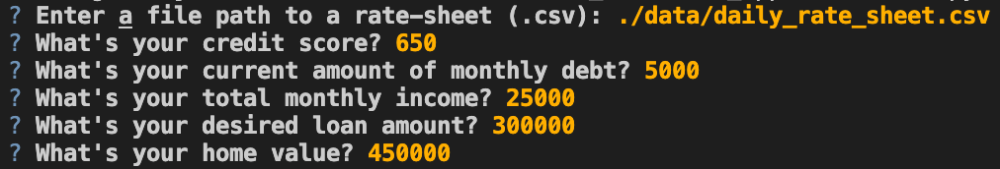

# Loan Qualifier

This program helps banks to automate the consumer loan acceptance process. The program will tell which bank loan products the customer is approved for based upon a number of criteria including credit score, debt, monthly income, desired loan amount and home value. The program aims to streamline the selection process and speed up banking operations.


---

## Technologies

This application is compatible with Python 3.9.
The libraries Fire and Questionary were used and must be installed in order for the program to run correctly.

Fire allows the user to input data directly from the command prompt. 
Questionary allows the user to input the data in a more user friendly "question and answer" format.

This program will work on Windows, MacOS and Linux with Python 3.9 installed. The user must have have access to and be able to navigate a CLI to run it.

Documentation for the Fire library can be found [here.](https://github.com/google/python-fire)

Documentation for the Questionary library can be found[here.](https://questionary.readthedocs.io/en/stable/)

---

## Installation Guide

Install the following dependencies before running the program.

To install the Fire and Questionary libraries type the following into your CLI:

```
python
pip install fire
pip install questionary
```

---

## Usage

To run the program type **app.py**.

```python
    python app.py
```
Once you run the program you will be prompted to enter the following information:
    
• Enter a file path to a rate-sheet (.csv):
• What's your credit score?
• What's your current amount of monthly debt?
• What's your total monthly income?
• What's your desired loan amount?
• What's your home value?



The output displays the monthly debt to income ratio, the loan to value ratio and identify how many loans the customer will qualify for.

The program completes by prompting the user to enter a filepath and name for the CSV save file and saves the data to a CSV.

---

## Contributors

Developed by:

Graham Johnstone
Email: johnstonegr@gmail.com

---

## License
This code is published under the Creative Commons License, 2021.

